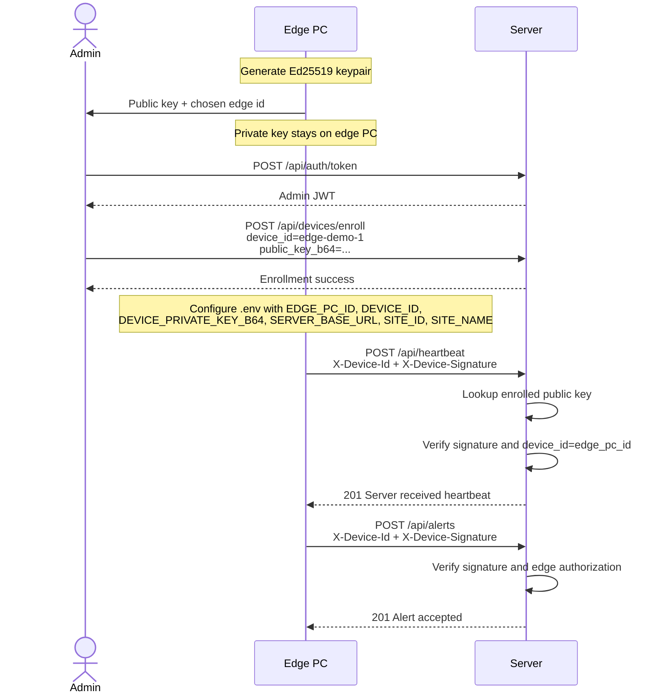

# Authentication And Edge Provisioning

This project now uses two separate auth paths:

- Admin JWT auth for protected server/admin endpoints such as `/api/logs` and `/api/devices/enroll`.
- Ed25519 device signatures for edge-to-server heartbeat and HTTP alert ingestion.

## Provisioning vs Runtime

There are two different moments in the edge-to-server flow:

- Provisioning: the one-time setup where an admin enrolls the edge public key on the server.
- Runtime: the repeated heartbeat and alert traffic where the edge proves its identity by signing requests with its private key.

The server does not auto-register a new edge from heartbeat alone. It only trusts an edge after its public key has been enrolled.

## What an edge PC needs at startup

Before an edge PC can start successfully against the server, you must provision these values onto it:

- `SERVER_BASE_URL`
- `SITE_ID`
- `SITE_NAME`
- `EDGE_PC_ID`
- `DEVICE_ID`
- `DEVICE_PRIVATE_KEY_B64`

Rules:

- `DEVICE_ID` must match `EDGE_PC_ID`.
- `DEVICE_PRIVATE_KEY_B64` must be the private half of an Ed25519 keypair.
- The matching public key must already be enrolled on the server under the same `device_id`.

In practice, the edge PC should be given:

- its logical identity: `EDGE_PC_ID`
- its site metadata: `SITE_ID`, `SITE_NAME`
- its private signing key: `DEVICE_PRIVATE_KEY_B64`
- the central server URL: `SERVER_BASE_URL`

It should not be given the public key as a runtime requirement; that stays on the server after enrollment.

## Operator Flow

This is the intended mental model:

1. Decide the edge identity, for example `edge-demo-1`.
2. Generate an Ed25519 keypair for that edge.
3. Keep the private key on the edge PC.
4. Take the public key to the server.
5. Enroll that public key on the server under `device_id=edge-demo-1`.
6. Configure the edge PC with:
   - `EDGE_PC_ID=edge-demo-1`
   - `DEVICE_ID=edge-demo-1`
   - `DEVICE_PRIVATE_KEY_B64=<private key>`
   - site and server settings
7. Start the edge agent.
8. The edge agent signs heartbeat and alerts, and the server verifies them using the enrolled public key.

## Sequence Diagram



If your Markdown preview does not render Mermaid, read the same flow as plain text:

1. Edge PC generates keypair.
2. Admin receives the public key and chosen edge id.
3. Admin authenticates to the server.
4. Admin enrolls the public key under that edge/device id.
5. Edge PC keeps the private key and runtime config locally.
6. Edge PC starts and sends a signed heartbeat.
7. Server verifies the signature using the enrolled public key.
8. Edge PC sends signed alerts.
9. Server verifies and accepts them.

## Server-side enrollment

1. Set `ADMIN_PASSWORD` on the server.
2. Request an admin token from `/api/auth/token`.
3. Enroll the edge public key at `/api/devices/enroll`.

PowerShell example:

```powershell
$token = (
  Invoke-RestMethod -Method Post `
    -Uri "http://127.0.0.1:8000/api/auth/token" `
    -Body @{ username = "admin"; password = "your-admin-password-here" }
).access_token

$body = @{
  device_id = "edge-demo-1"
  public_key_b64 = "<BASE64_PUBLIC_KEY>"
} | ConvertTo-Json -Compress

Invoke-RestMethod -Method Post `
  -Uri "http://127.0.0.1:8000/api/devices/enroll" `
  -Headers @{ Authorization = "Bearer $token" } `
  -ContentType "application/json" `
  -Body $body
```

## Edge PC commands

These are the practical commands to run on the edge PC during provisioning and startup.

### 1. Generate the Ed25519 keypair on the edge PC

Run this on the edge machine:

```powershell
@'
import base64
from cryptography.hazmat.primitives.asymmetric.ed25519 import Ed25519PrivateKey

sk = Ed25519PrivateKey.generate()
print("PRIVATE_KEY_B64=" + base64.b64encode(sk.private_bytes_raw()).decode())
print("PUBLIC_KEY_B64=" + base64.b64encode(sk.public_key().public_bytes_raw()).decode())
'@ | python -
```

What to do with the output:

- Keep `PRIVATE_KEY_B64` on the edge PC only.
- Take `PUBLIC_KEY_B64` to the server or dashboard for enrollment.

### 2. Set the edge PC environment

After the public key has been enrolled on the server, set the edge runtime config on the edge PC:

Option A: put these values in the edge PC `.env` file:

```env
SERVER_BASE_URL=http://127.0.0.1:8000
SITE_ID=site_demo
SITE_NAME=Demo Site
EDGE_PC_ID=edge-demo-1
DEVICE_ID=edge-demo-1
DEVICE_PRIVATE_KEY_B64=<PRIVATE_KEY_B64>
```

Option B: set them in the current PowerShell session:

```powershell
$env:SERVER_BASE_URL="http://127.0.0.1:8000"
$env:SITE_ID="site_demo"
$env:SITE_NAME="Demo Site"
$env:EDGE_PC_ID="edge-demo-1"
$env:DEVICE_ID="edge-demo-1"
$env:DEVICE_PRIVATE_KEY_B64="<PRIVATE_KEY_B64>"
```

Important:

- `DEVICE_ID` must match `EDGE_PC_ID`.
- The enrolled server-side `device_id` must also be that same value.

### 3. Start the edge agent

From the repo root on the edge PC:

```powershell
$env:PYTHONPATH="$PWD\src"
python -m edge_agent.main --http-serve
```

### 4. Send a signed alert from the edge PC

This uses the real edge sender path:

```powershell
$env:PYTHONPATH="$PWD\src"
@'
from edge_agent.config import EdgeSettings
from edge_agent.sender import ServerSender

cfg = EdgeSettings()
sender = ServerSender(cfg)
ok = sender.send_alert(
    camera_id="cam-1",
    detections=[{"class": "person", "confidence": 0.99}],
)
print("alert_sent =", ok)
'@ | python -
```

### 5. Optional local edge API check

If the edge HTTP API is running, you can confirm the edge agent is alive locally:

```powershell
Invoke-RestMethod -Method Get -Uri "http://127.0.0.1:8128/heartbeat"
```

## Dashboard Support

Current state:

- The dashboard now has a `Settings -> Security` section for enrolling an edge PC public key on the active target.
- The dashboard still uses the same admin API under the hood: `/api/devices/enroll`.

What is possible:

- The intended dashboard flow is:
  - generate the keypair on the edge PC
  - paste only the public key into the dashboard
  - let the dashboard call `/api/devices/enroll`

That approach keeps the private key off the server and gives a simpler operator workflow.

## Runtime request signing

The edge agent signs requests automatically when configured with `DEVICE_PRIVATE_KEY_B64`.

Server behavior:

- `POST /api/heartbeat` requires `X-Device-Id` and `X-Device-Signature`.
- `POST /api/alerts` requires `X-Device-Id` and `X-Device-Signature`.
- `POST /api/alerts/upload` requires `X-Device-Id` and `X-Device-Signature`.
- Unknown devices return `401`.
- Revoked or inactive devices return `403`.
- If `device_id` does not match the claimed `edge_pc_id`, the request is rejected with `403`.

Signing scheme:

- For JSON requests (`/api/heartbeat`, `/api/alerts`), sign the exact raw JSON request body bytes.
- For multipart uploads (`/api/alerts/upload`), sign:
  `site_id|camera_id|edge_pc_id|timestamp|sha256(image_bytes)`

## Operational meaning

To bring up a new edge PC:

1. Generate an Ed25519 keypair.
2. Enroll the public key on the server using the chosen edge/device id.
3. Place the matching private key and identity values into the edge PC `.env`.
4. Start the edge agent.

If any of those are missing, heartbeat and alert delivery will fail by design.
